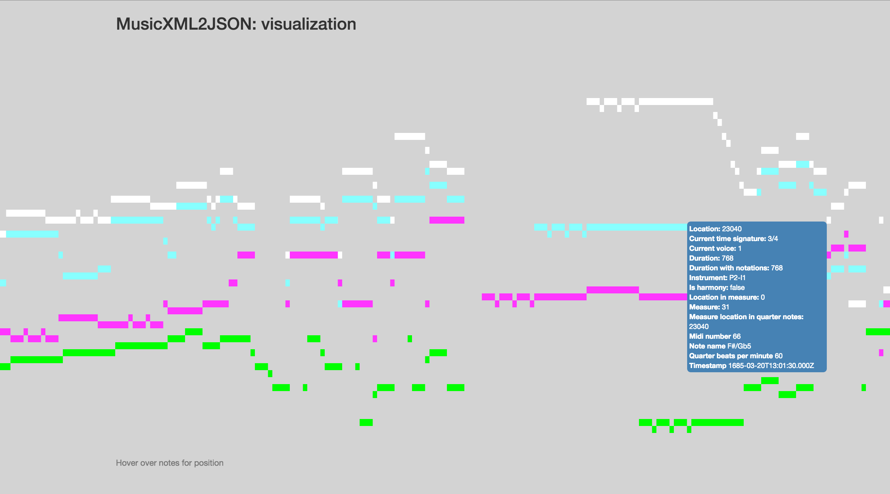

<h2>MusicXML2JSON</h2>

<div>The purpose of this Node module is to convert MusicXML files into timestamped JSON files, in order to make this type of data more suited to time-series analysis and data visualization. One of the drawbacks of MusicXML is that it does not explicitly encode time information (in the sense that any particular note or rest can not be interrogated for its temporal position).<br></div>

<div>MusicJSON sets out to solve this conundrum!</div>


<h3>Sample output</h3>


```javascript
    {
      "midiNumber": 43,
      "isHarmony": false,
      "measure": 170,
      "duration": 256,
      "instrument": "P4-I1",
      "currentVoice": 1,
      "location": 768,
      "durationWithNotations": 256,
      "beats": 4,
      "beatType": 4,
      "absLocation": 160768,
      "measureLocationInQuarterNotes": 160000,
      "timeStamp": "1685-03-20T13:10:28.000Z",
      "qbpm": 60
    },
    {
      "midiNumber": 36,
      "isHarmony": false,
      "measure": 171,
      "duration": 256,
      "instrument": "P4-I1",
      "currentVoice": 1,
      "location": 0,
      "durationWithNotations": 256,
      "beats": 4,
      "beatType": 4,
      "absLocation": 161024,
      "measureLocationInQuarterNotes": 161024,
      "timeStamp": "1685-03-20T13:10:29.000Z",
      "qbpm": 60
    },
```


<h3>Usage</h3>
<div>Run the MusicXML2JSON module with the followng command. It will output a data.json file into the ./data folder </div>
<br>
```javascript
node convertMusicXMLToJSON.js -m "pathToYouMusicXMLFile.xml"
```


<h3>Tests</h3>
<div>The most convenient way I have found to test this data is using a pianoroll visualization, so I have included this along the with the usual testing you would expect. This a tiny node/express app, and will look for data where the musicJSON file will be placed. </div>
<br>

```javascript
node visualizeData.js
```
<br>
<div> Runing the visualization command above will make the visualization available from localhost:8080 and will look like figure 1. </div>
<br>
<h6>Figure 1.</h6>
<p align="center">
  
 
</p>

<h3>Explanation of attributes</h3>

<h3>Instrument</h3>
<div>
   Instrument name
</div>
<h5>Voice</h5>
<div>
   Voice number within MusicXML part
</div>

<h5>Midi number</h5>
<div>
   Number between 0 and 127 where 60 = Middle C = C4 
</div>
<h5>Duration</h5>
<div>
   Lengh of a note or rest, where quarter note = 256
</div>

<h5>Duration due to tied notes</h5>
<div>
   Modifier of the Duration attribute, due to tied values. Notes that are tied to a next note will accumulate the duration of the next note. Notes that are tied to a prior note will have 0 value.
</div>

<h5>Harmony note flag</h5>
<div>
   Boolean indicating note has been encoded as a MusicXML chord
</div>
<h5>Measure</h5>
<div>
   Integer representing current measure
</div>
<h5>Absolute Location</h5>
<div>
   Location of a beginning of a note of rest, where a quarter note = 256
</div>

<h5>Measure location</h5>
<div>
   Location of a measure in quarter notes, where a quarter note = 256
</div>

<h5>Location in measure</h5>
<div>
   Location of the beginning of a note or rest within a measure, where a quarter note = 256
</div>

<h5>Time signature numerator</h5>
<div>
   Number of beats in a measure
</div>

<h5>Time signature denominator</h5>
<div>
   Type of beats in a measure
</div>

<h5>Quarter beats per minute</h5>
<div>
   This is a standard bpm metronome measure, however, all values are converted to quarter note beats per minute.
</div>
<h5>Timestamp</h5>
<div>
   Time relative to beginning of music, calculated from the Absolute Location and Quarter Beats Per Minute attribute
</div>


<h3>Future work</h3>
<div>I have focused on the parts of a MusicXML specification that I need for a particular research project that centers around time, frequency, and location type information. If there is anything you want added let me know, or send a pull request.   </div>
<div>
One this missing is the encoding of global metadata (things such as composed year etc). Will include that as soon as possible.  
</div>