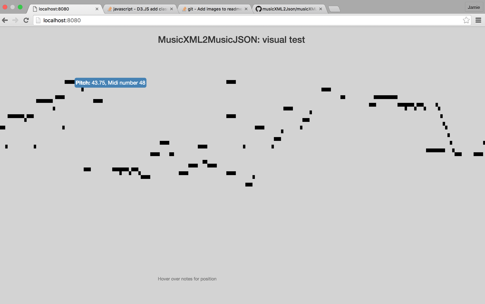

<h2>MusicXML2Json Node Module</h2>

<div>The purpose of this module is to convert MusicXML files to timestamped JSON.</div>


<div>Sample output:</div>


```javascript
{[
{ 
  midiNumber: 56,
  isHarmony: false,
  measure: '31',
  duration: 768,
  instrument: 'P3-I1',
  currentVoice: 1,
  notations: [ { tied: [Object] } ],
  location: 0,
  durationWithNotations: 768 
},
  { 
  midiNumber: 56,
  isHarmony: false,
  measure: '32',
  duration: 512,
  instrument: 'P3-I1',
  currentVoice: 1,
  notations: [ { tied: [Object] } ],
  location: 0,
  durationWithNotations: 512
}
]}
```



<h2>Time encoding</h2>
<h3>Duration</h3>
<p>MusicXML2Json keeps to the MusicXML convention as a whole note equating to 1024, and bases all calculations around this. In order to keep all durations consisent, it encoded with two numbers, 1024 and a denominator number for division. For example, a quarter note is encoded as 4, being 1024 / 4 = 256. A quater note triplet is encoded as 6, being 1024 / 6. This avoids the irrational numbers and makes aggregation easier based on a quarter note divisions. The whole note has been kept at 1024 as per the musicXML specification. All durations are are a division of 1024, so a quarter note triplet is encoded as the rational number 1024/6</p>
<p>Duration has been encoded with two attributes, duration, and durationWithNotations. The durationWithNotations is the important one as it will include any tied note information </p>
<h3>Location</h3>
<p>Location is encoded with two attributes, a measure int and location in the bar as denominator.</p>

<h2>Other encoding</h2>
<h3>Markings</h3>
<p>Markings is an array of string values including any additional information besides frequency, location and duration. This works well for me, but it is easy to modify the code to change this if needed. I have worked through the MusicXML spec. There are probably faster ways to do this, but its here being used as a preprocessor</p>

<h2>Testing</h2>
<p>The tests folder contains  what you would expect. I have also included some visualisation tests D3.js and Express</p>

<h3>Usage</h3>
<p>Logging is optional and handy to turn on if run into any issues during parsing. You can pass a flag to return basic stats. You can also pass the module a metadata object, a group of key value pairs which will also be included in the note and rest events </p>